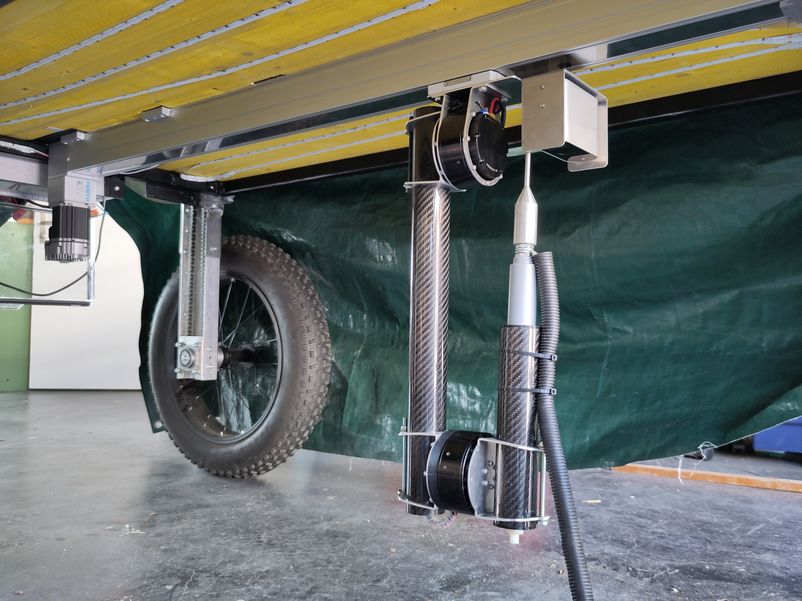

# ros-weed-control
This repository contains all ROS 2 packages that were developed for the OFA Weed Control Unit. The unit is composed of a RGB-D camera to detect weeds on the ground and a 3-DOF robot arm equipped with an electrode at the end to electrucute the detected weeds. 

A detailed description of the system can be found in chapters 3 and 4 of the [report](Weed%20Control%20Unit%20Report%20Haldemann.pdf).

## Hardware
The assembled prototype is shown below.



The main hardware components of the weed control unit are listed in the following table.

| Component | Description | Quantity |
| --- | --- | --- |
| [reComputer Industrial J4011](https://www.seeedstudio.com/reComputer-Industrial-J4011-p-5681.html) | Computer with onboard GPU and CAN interface | 1 |
| [Orbbec Femto Bolt](https://www.orbbec.com/products/tof-camera/femto-bolt) | RGB-D camera | 1 |
| [CubeMars AK70-10](https://www.cubemars.com/goods-1031-AK70-10.html) | Planetary gear motor | 2 |
| [Teknic CPM-SCSK-2321S-EQNA](https://teknic.com/model-info/CPM-SCSK-2321S-EQNA/?model_voltage=24) | Linear axis motor | 1 |
| [Festo ELGC-TB-KF-60-1000](https://www.festo.com/ch/en/a/8062781/?identCode1=ELGC-TB-KF-60-1000) | Toothed belt linear axis | 1 |


## Software
Both the control of the robot arm and the weed detection are handled by the main computer. Most of the code running on the reComputer Industrial is published in this repository. Only the hardware interfaces for the motors are in seperate repositories:
- [CubeMars](https://github.com/OpenFieldAutomation-OFA/cubemars_hardware)
- [Teknic](https://github.com/OpenFieldAutomation-OFA/teknic_hardware)

### Setup
The following steps describe the setup of the reComputer Industrial, assuming it was flashed with JetPack 6.0 as described [here](https://wiki.seeedstudio.com/reComputer_Industrial_Getting_Started/#flash-to-jetson). If you use a different computer or Jetpack version you will have to figure out how to reproduce the setup yourself.

1. Update the system.
    ```bash
    sudo apt update && sudo apt upgrade -y
    ```
2. Enable the [maximum power mode](https://wiki.seeedstudio.com/reComputer_Industrial_J40_J30_Hardware_Interfaces_Usage/#max-performance-on-recomputer-industrial).
    ```bash
    sudo nvpmodel -m 0
    ```
3. Install [jetson-stats](https://rnext.it/jetson_stats/) (for monitoring).
    ```bash
    sudo pip3 install -U jetson-stats
    ```
4. Install the udev rules for the Orbbec Femto Bolt.
    ```bash
    echo 'SUBSYSTEMS=="usb", ATTRS{idVendor}=="2bc5", ATTRS{idProduct}=="066b", MODE:="0666",  OWNER:="root", GROUP:="video", SYMLINK+="Femto Bolt"' | sudo tee /etc/udev/rules.d/99-obsensor-libusb.rules
    sudo udevadm control --reload-rules && sudo udevadm trigger
    ```
5. Enable the SocketCAN interface on boot.
    ```bash
    sudo systemctl enable systemd-networkd
    echo -e '[Match]\nName=can0\n[CAN]\nBitRate=1M' | sudo tee /etc/systemd/network/80-can.network
    ```
6. Install [ROS 2 Iron](https://docs.ros.org/en/iron/Installation/Ubuntu-Install-Debians.html).
    ```bash
    sudo curl -sSL https://raw.githubusercontent.com/ros/rosdistro/master/ros.key -o /usr/share/keyrings/ros-archive-keyring.gpg
    echo "deb [arch=$(dpkg --print-architecture) signed-by=/usr/share/keyrings/ros-archive-keyring.gpg] http://packages.ros.org/ros2/ubuntu $(. /etc/os-release && echo $UBUNTU_CODENAME) main" | sudo tee /etc/apt/sources.list.d/ros2.list > /dev/null
    sudo apt update
    sudo apt install ros-dev-tools
    sudo apt install ros-iron-desktop
    ```
7. Create the ROS workspace.
    ```bash
    source /opt/ros/iron/setup.bash
    echo "source /opt/ros/iron/setup.bash" >> ~/.bashrc
    mkdir -p ~/ros2_ws/src
    cd ~/ros2_ws/src
    git clone https://github.com/OpenFieldAutomation-OFA/ros-weed-control-ros.git
    vcs import < ros-weed-control/dependencies.repos
    cd ~/ros2_ws
    sudo rosdep init
    rosdep update
    rosdep install --from-paths src -y --ignore-src
    ```
8. Install the ONNX Runtime and download the pretrained model.
    ```bash
    cd ~/ros2_ws/src/ros-weed-control/ofa_detection
    pip install numpy==1.26.4
    pip install onnxruntime_gpu-1.20.0-cp310-cp310-linux_aarch64.whl
    wget https://github.com/OpenFieldAutomation-OFA/plant-training/releases/download/v0.0.0/finetuned_small.onnx -P model/
    wget https://github.com/OpenFieldAutomation-OFA/plant-training/releases/download/v0.0.0/finetuned.onnx -P model/

    # We generate the tensorrt engine file manually because the builder in onnxruntime does not work correctly for some reason
    mkdir -p model/trt_engine
    /usr/src/tensorrt/bin/trtexec --onnx=model/finetuned_small.onnx --saveEngine=model/trt_engine/TensorrtExecutionProvider_TRTKernel_graph_main_graph_6398305485275041207_0_0_sm87.engine --fp16
    /usr/src/tensorrt/bin/trtexec --onnx=model/finetuned.onnx --saveEngine=model/trt_engine/TensorrtExecutionProvider_TRTKernel_graph_main_graph_12799879847838785250_0_0_sm87.engine --fp16
    ```
9. Install the SC4-Hub USB Driver.
    ```bash
    # Fix linux headers symlink
    sudo ln -sf /usr/src/linux-headers-5.15.136-tegra-ubuntu22.04_aarch64/3rdparty/canonical/linux-jammy/kernel-source /lib/modules/5.15.136-tegra/build
    # Install driver
    cd ~/ros2_ws/src/teknic_hardware/ExarKernelDriver
    sudo ./Install_DRV_SCRIPT.sh
    # Give user access to serial ports
    sudo usermod -aG dialout $USER
    ```
10. Reboot.
    ```bash
    sudo reboot
    ```

### Run Program
After the setup you can build the packages.
```bash
cd ~/ros2_ws
colcon build --symlink-install
```
In a new terminal source the overlay.
```bash
cd ~/ros2_ws
source install/local_setup.bash
```
Now you can use any of the commands described in the [`ofa_bringup`](ofa_bringup) package.
```bash
ros2 launch ofa_bringup display.launch.py
```

### Docker
If you want to develop or run the code on a different machine than the Jetson, you can use our Docker image and a [Dev Container](https://code.visualstudio.com/docs/devcontainers/containers).

On your machine (Linux or WSL) clone this repo. Open the `ros-weed-control` folder in VS Code and run **Dev Containers: Rebuild and Reopen in Container**. This will automatically build and run the container. Then open two new terminals, one for running `colcon build --symlink-install` and one for sourcing the workspace with `source install/setup.bash`.

After that you can run all the same commands as on the Jetson, as long as you don't use `use_mock_hardware:=false` (because we have no access to the hardware).

Note that CUDA is not installed inside the container so inference will be done on the CPU and be very slow.

## URDF
The URDF description of the robot is stored in [`ofa_robot_description.urdf.xacro`](ofa_moveit_config/urdf/ofa_robot_description.urdf.xacro). Everytime the URDF is changed, you need to update the IKFast plugin and regenerate the SRDF file of the MoveIt config. Details about these two steps can be found in the readme of [`ofa_ikfast_plugin`](ofa_ikfast_plugin) and [`ofa_bringup`](ofa_bringup).